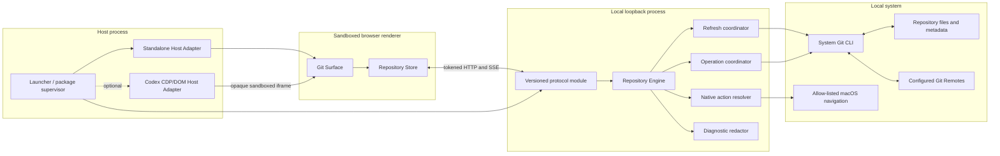
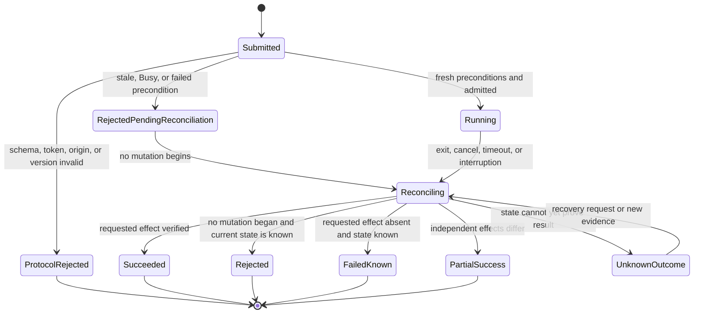
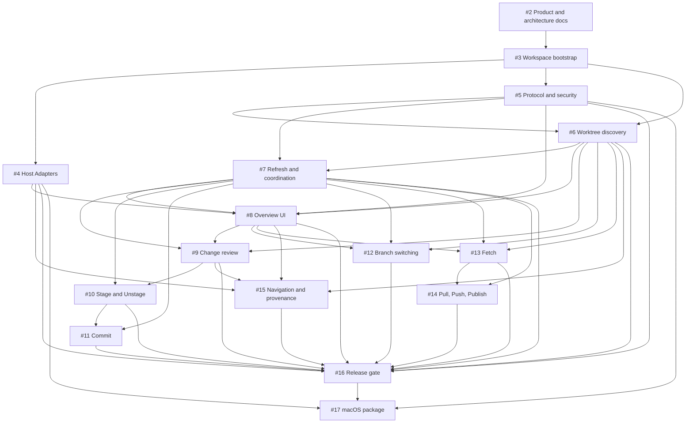

# Codex Git MVP technical architecture

## Status and scope

This document defines the architecture for the macOS MVP in the
[product requirements](../product/mvp-prd.md). It uses the canonical language in
[`CONTEXT.md`](../../CONTEXT.md) and records two accepted, hard-to-reverse choices:

- [Isolate Codex host integration behind a Host Adapter](../adr/0001-isolate-codex-host-integration.md)
- [Use the system Git CLI behind a local Repository Engine](../adr/0002-use-system-git-behind-repository-engine.md)

The architecture covers the source-mode runtime and the later thin macOS package.
It does not add product behavior beyond the PRD and does not choose detailed UI
styling.

## Architectural drivers

1. Git correctness spans a Repository containing independent Worktree Working
   Trees, Indexes, and HEADs plus shared objects, refs, configuration, and
   Worktree registration.
2. Codex tasks and external Git processes may change those states at any time.
3. The browser surface cannot safely hold filesystem or process authority.
4. Codex Desktop has no official extension point assumed by this MVP for adding
   the required top-level surface.
5. The supported fixture requires bounded, selected-first observation rather than
   serial full-Repository reads after every event.
6. Process exit is not sufficient proof of a mutation outcome after interruption,
   timeout, hook/signing behavior, or partial multi-target work.

## Architecture rules

- Keep the unsupported Codex CDP/DOM implementation behind the Host Adapter seam.
- Keep the standalone adapter functional against the same host interface and Git
  surface.
- Run all Git reads and mutations in the local Repository Engine.
- Let the browser express typed product intent only; it never executes a shell or
  constructs Git arguments.
- Use opaque IDs and coherent, versioned snapshots across every untrusted seam.
- Never authorize a mutation from UI state without fresh local precondition
  checks.
- Discover Worktrees from Git registration; provenance neither filters discovery
  nor grants Git capabilities.
- Reject conflicting operations as Busy rather than silently queueing user
  mutations.
- Reconcile every state axis affected by every attempted mutation, including
  cancellation, interruption, and timeout.
- Never remove external locks, rewrite history, auto-stash, prune by default, or
  collect credentials.
- Keep modules deep: callers learn small product interfaces while discovery,
  validation, Git invocation, redaction, coordination, and recovery remain local
  to their owning implementation.

## Process model



### Launcher and later package supervisor

The source launcher composes adapters, the local server, and the surface. The
packaged application uses Tauri 2 only as a thin supervisor for bundled runtime
processes, chooses an ephemeral loopback port, passes launch secrets in memory
where possible, monitors health, and tears down listeners and CDP connections. It
does not contain Git product behavior or reimplement Repository Engine behavior in
Rust.

### Local loopback process

The loopback process is the authority for Repository identity, filesystem access,
Git processes, current snapshots, operation admission, native actions, redaction,
and recovery. It owns all mutable backend session state, including Commit Drafts
and duplicate-operation records.

### Sandboxed browser renderer

The renderer owns presentation, selection, filters, accessible interaction, and a
single Repository Store. It treats server snapshots as authoritative and submits
typed intent with the opaque targets and revisions it observed. It has no Node.js
filesystem or child-process access.

## Official capability versus unsupported integration

The MVP assumes ordinary documented operating-system and Git capabilities:

- a local macOS process may bind an ephemeral loopback listener;
- the system Git executable supplies Repository, Worktree, refs, hooks, signing,
  and configured credential behavior;
- documented macOS mechanisms may open Terminal/Finder/default applications for
  validated local targets;
- the standalone browser surface can load the same built application and protocol.

The MVP does **not** assume an official Codex Desktop plugin or extension interface
for adding a sidebar destination, embedding a page, reading Current Project/task
context, or navigating to a task/file. Those behaviors belong exclusively to the
unsupported `CodexCdpHostAdapter`, use compatibility probes against explicitly
recorded Codex builds, and are never required for Repository correctness.

The adapter must not modify Codex application bundles, files, or private JavaScript
state. If its probe fails, it must leave the native UI untouched and return a
typed fallback result that launches or points to the standalone surface.

## Module seams and interfaces

The following TypeScript is conceptual public shape. Runtime schemas at the
protocol seam remain authoritative for untrusted input.

### Host Adapter

The Host Adapter is a real seam because two adapters vary: standalone and Codex
CDP/DOM. The interface hides discovery, mounting, remount, cleanup, theme/context
transport, host navigation, and compatibility behavior.

```ts
interface HostAdapter {
  attach(request: HostAttachRequest): Promise<HostAttachResult>;
}

type HostAttachResult =
  | { kind: 'attached'; connection: HostConnection }
  | { kind: 'standalone-required'; reason: SanitizedDiagnostic };

interface HostConnection {
  currentContext(): HostContext;
  contexts(): AsyncIterable<HostContext>;
  perform(action: HostAction): Promise<HostActionResult>;
  close(): Promise<void>;
}
```

The interface contains named product actions, never arbitrary URLs, JavaScript,
DOM selectors, filesystem paths, or CDP commands. A connection has one generation;
messages from an old renderer/frame generation are rejected.

### Repository Engine

The Repository Engine is the deepest module. Removing it would spread canonical
identity, Git process recipes, parsing, freshness validation, coordination,
outcomes, and redaction across the server and UI.

```ts
interface RepositoryEngine {
  open(anchor: ProjectAnchor): Promise<RepositorySession>;
}

interface RepositorySession {
  snapshot(): Promise<RepositorySnapshot>;
  subscribe(): AsyncIterable<RepositoryInvalidation>;
  diff(request: DiffRequest): Promise<DiffResult>;
  searchBranches(request: BranchSearch): Promise<BranchSearchResult>;
  updateDraft(request: DraftUpdate): Promise<CommitDraft>;
  dispatch(command: ProductCommand): Promise<OperationReceipt>;
  recover(operationId: OperationId): Promise<OperationResult>;
  perform(action: NativeAction): Promise<NativeActionResult>;
  close(): Promise<void>;
}
```

Callers do not learn executable paths, Git argv, lock paths, repository layout,
watcher details, retry rules, or credential handling. Tests exercise the same
session interface as production callers against real temporary Git repositories.

### Versioned protocol

The protocol module is the only browser-to-local seam. It owns runtime schemas,
protocol negotiation, authentication, size limits, structured errors, and mapping
between transport payloads and Repository Session calls. It does not duplicate
Repository Engine policy.

### Repository Store

The UI uses one external Repository Store consumed through
`useSyncExternalStore`. The store owns the latest snapshot, connection status,
selected Worktree/file IDs, filters, and operation progress. It never invents Git
state optimistically; an operation receipt may show progress but only a new
snapshot changes Git facts.

### Internal seams

The Repository Engine may use private parser, process-runner, filesystem-observer,
clock, and scheduler interfaces for deterministic tests. These are internal seams,
not public packages or protocol concepts. A second production adapter is required
before promoting any internal seam to a public interface.

## Identity and snapshot model

### Canonical identity

Repository identity derives from the canonical common Git directory resolved by
Git, not from the Current Project path. Worktree identity derives from canonical
Git registration plus a generation nonce/evidence record maintained for the open
session.

Opaque `RepositoryId`, `WorktreeId`, `FileId`, `RefId`, `RemoteId`, and
`OperationId` values are random or keyed identifiers with no client-constructible
path/ref meaning. Server maps bind them to one session and relevant generation.

Path reuse never revives identity. If a Worktree registration disappears, moves,
is recreated, or loses continuous identity evidence, old Worktree and descendant
IDs expire.

### Revision axes

```ts
interface RepositorySnapshot {
  repositoryId: RepositoryId;
  repositoryRevision: number;
  topologyRevision: number;
  refsRevision: number;
  refresh: RefreshState;
  worktrees: readonly WorktreeSnapshot[];
  operations: readonly OperationSummary[];
}

declare const worktreeGenerationBrand: unique symbol;
type WorktreeGeneration = string & {
  readonly [worktreeGenerationBrand]: true;
};

interface WorktreeSnapshot {
  worktreeId: WorktreeId;
  worktreeRevision: number;
  generation: WorktreeGeneration;
  head: HeadState;
  indexTree: ObjectId | null;
  status: WorktreeStatus;
}
```

- `repositoryRevision` changes when any externally visible snapshot fact changes.
- `topologyRevision` changes when Repository/Worktree registration or availability
  changes.
- `refsRevision` changes when shared Local or Remote-tracking refs, Remotes, or
  Upstream configuration changes.
- `worktreeRevision` changes only for facts owned by one Worktree, including its
  HEAD/Index/status observation.

A snapshot response is coherent for its declared revisions. The coordinator may
refresh selected and non-selected Worktrees at different times, but it publishes a
new immutable snapshot atomically and marks any retained observation with its own
freshness.

### Target bindings

A `FileId` binds Worktree generation, Worktree revision, path bytes, status kind,
and Diff Baseline. A `RefId` binds full ref name, target object ID, refs revision,
and relevant occupancy. A native target binds its Worktree generation and exact
canonical path rules.

IDs communicate identity, not authorization. Dispatch still re-resolves the map
entry and verifies its matching axes immediately before execution.

## Repository and Worktree discovery

1. Ask system Git to resolve the anchor to the canonical common Git directory.
2. If Git reports a non-repository, return the typed non-repository result without
   attempting mutation or walking parent directories independently.
3. Run `git worktree list --porcelain -z` against that Repository as the sole
   inventory authority.
4. Parse NUL-delimited records without assuming `.git/worktrees` layout.
5. Canonicalize paths without losing the original display path or unusual bytes.
6. Classify Main, linked, locked reason, prunable/missing, Branch, and detached
   Commit facts.
7. Compare with the prior topology map to retain or replace Worktree generations.
8. Publish unavailable diagnostics without repair, prune, or lock removal.

No directory scan, `.codex` folder, Branch prefix, task title, or provenance record
may add or remove a Worktree. The optional provenance adapter joins stable metadata
onto an already-complete Git inventory.

## Git execution contract

### Authority and command construction

Only a private Git process runner inside the Repository Engine may select the
system Git executable and construct arguments. Each Product Command maps to one
allow-listed recipe with literal argv, an explicit working directory or Git
directory, a sanitized environment policy, bounded stdin/stdout/stderr, a timeout,
and cancellation/reconciliation behavior.

The runner never invokes a shell. Client input never becomes an executable,
option, refspec, configuration override, environment variable, or absolute path.
Path sets use Git's NUL-delimited path input capabilities and an explicit
end-of-options contract. Commit messages use stdin or a private file descriptor.

### Read policy

- Worktree inventory uses porcelain NUL output.
- status uses `--porcelain=v2 -z --branch --untracked-files=all`.
- refs and Branch search use full ref names and object IDs from machine-readable
  output; tags and symbolic Remote HEAD aliases are filtered server-side.
- diffs identify explicit baselines and disable external diff/text conversion.
- reads have output limits and return an explicit too-large/unsupported result
  rather than truncating content into a plausible false state.
- local Refresh never runs a network-capable Git command.

### Mutation policy

- Stage and Unstage accept only resolved File IDs and affect the selected Index.
- Commit preserves hooks and configured signing and does not synthesize identity.
- Branch switching names an exact full ref and uses no force, stash, or carry
  behavior.
- Fetch names exact configured Remotes and does not prune by default.
- Pull targets the exact displayed Upstream and enforces fast-forward-only.
- Push targets the current Local Branch's exact Upstream and never includes force,
  matching refs, tags, or deletion.
- Publish names a confirmed Remote and same-name target and sets Upstream only
  after verified transfer.

Implementation tests assert exact argv and environment for every recipe, including
paths beginning with `-`, whitespace, Unicode, and newlines. The package supervisor
cannot add alternate recipes.

### Git-native behavior

Hooks, signing, credential helpers, SSH, server policy, filesystem permissions,
and Git locks remain active. The Engine classifies their observable failures and
redacts diagnostics; it does not bypass, configure, or remove them.

## Refresh architecture

### Triggers

- Repository Session open
- browser focus or visibility return
- Current Project change
- selected Worktree filesystem or Index invalidation
- common Git directory, refs, configuration, or Worktree registration invalidation
- manual Refresh
- every operation terminal or uncertain outcome
- staggered non-selected Worktree poll
- full Repository discovery fallback poll

### Selected-first pipeline

The coordinator resolves topology and shared refs as needed, then prioritizes the
selected Worktree's HEAD, Index, and status. Non-selected Worktrees refresh with
bounded concurrency and staggered polling. Equivalent pending reads are
deduplicated.

Every refresh run owns a generation. Results can be merged only when their source
generation and prerequisite topology/refs axes remain current. Late old results
are discarded rather than allowed to overwrite a newer snapshot.

Filesystem events are invalidation hints, not Git truth. Debouncing may combine
events; only Git reads produce a snapshot. Watcher loss or unsupported paths fall
back to polling.

### Failure and stale data

The last successful snapshot remains visible after a read failure with explicit
error, freshness, and stale state. A failed read never replaces known status with
Clean, an empty Change Group, no Branch, or no Worktree.

SSE transmits revision/progress invalidations, not authoritative incremental Git
patches. On invalidation or stream recovery, the UI requests a coherent snapshot.

## Operation coordination

### Lanes

| Lane             | Scope               | Primary operations           | Cardinality        |
| ---------------- | ------------------- | ---------------------------- | ------------------ |
| Local mutation   | Worktree generation | Stage, Unstage, Commit       | One per Worktree   |
| Branch switch    | Repository          | Local/Remote-tracking switch | One per Repository |
| Remote operation | Repository          | Fetch, Pull, Push, Publish   | One per Repository |

Admission is atomic and never waits in a user-visible mutation queue. If a required
lane or conflicting state claim is held, dispatch returns Busy with the active
operation summary.

Lanes are the coarse coordination rule; state claims close cross-lane races. A
Branch switch claims its target Worktree HEAD/Index and Repository occupancy axes.
Pull claims its target Worktree plus Upstream/ref axes. Push/Publish claim the
source Branch OID and destination mapping. Commit claims its Worktree HEAD/Index
and exact Local Branch reference when attached. Admission rejects an overlap whose
effects could change another operation's verified target.

Independent local mutations in different Worktrees remain concurrent when their
exact refs and state claims do not conflict. Read-only Refresh continues with
bounded concurrency, but mutation postconditions publish only through
reconciliation.

### Precondition axes

Every Product Command declares the axes it observed and the Engine must refresh:

- Repository identity
- Worktree ID and generation
- topology/availability
- Worktree revision and status kind
- HEAD object ID and Local Branch attachment
- Index tree object ID
- file path bytes and Diff Baseline
- refs revision and exact target object ID
- Branch Occupancy
- Remote identity and URL/config generation
- Upstream source and destination full refs
- operation-lane availability

The Engine checks only relevant axes so an unrelated Worktree mutation does not
invalidate independent evidence. Producers and consumers share the same canonical
comparison functions; no producer may issue an ID for a value its consumer would
reject.

### Operation lifecycle



Protocol rejection is not a Product Command outcome: malformed or unauthorized
transport input cannot reach the Repository Session. Once a valid Product Command
does reach dispatch, stale, Busy, and other failed preconditions produce a
Rejected outcome only after relevant state axes are freshly observed and
published. No Git mutation begins on that path.

Each accepted command has a client command ID, a fingerprint of its fully
validated intent, and a server `OperationId`. An exact idempotent retry with the
same ID and fingerprint returns the prior receipt/result and never starts a second
process. Reusing an ID with a different fingerprint is a command-ID collision: the
protocol rejects it without dispatch. Cancellation requests intent but cannot
assert rollback or termination before the process and Git state are observed.

Every attempted mutation reconciles the axes it could affect. Unknown Outcome
retains recovery metadata and disables blind retry until later reconciliation can
classify the state or route the user to safe manual inspection.

## Change and diff architecture

The status parser produces independent observations, not one mutable record per
path. An ordinary entry may yield a Staged Change, a Change, or both. Conflict and
Untracked records preserve their own semantics. Rename observations retain both
old and new path bytes.

On-demand diff takes a `FileId`, validates its Worktree generation and baseline,
then reads exactly one of:

- HEAD to Index for Staged Change
- Index to Working Tree for Change
- empty input to Working Tree for Untracked File
- explicit conflict metadata/content for Conflict

Before text rendering, the Engine detects binary content, decoding failure, bytes,
and line count. It returns a tagged metadata result for binary, undecodable,
over-2-MiB, or over-20,000-line content. Process output limits are stricter than
memory/UI limits so an external process cannot exhaust the server before
classification.

Diff results contain display content and opaque navigation targets but no
client-authoritative absolute path. UI Previous/Next order derives from the current
snapshot's selected Worktree/group/filter, not from server mutation state.

## Loopback protocol and security

### Instance security

- Bind `127.0.0.1` only and ask the operating system for an ephemeral port.
- Generate at least 256 bits of randomness per launch.
- Put the launch token in an unguessable URL path rather than logs, query strings,
  or ordinary error messages.
- Validate token, protocol version, method, content type, body size, runtime schema,
  command-ID/fingerprint consistency, and expected origin before calling a product
  module.
- Permit the opaque Codex iframe's `Origin: null` only after token and protocol
  validation; reject unexpected browser origins and non-loopback peers.
- Expire the token and all opaque IDs when the server instance ends.

### Endpoint families

| Family        | Purpose                             | Authority returned/accepted             |
| ------------- | ----------------------------------- | --------------------------------------- |
| Session       | protocol/capability negotiation     | session metadata only                   |
| Snapshot      | coherent Repository state           | opaque IDs and revisions                |
| Diff          | one validated on-demand review      | display content/metadata only           |
| Branch search | cached exact ref candidates         | opaque Ref IDs                          |
| Draft         | get/update/clear one Worktree draft | text with size limit                    |
| Command       | submit typed product mutation       | operation receipt                       |
| Operation     | progress/result/recovery            | typed outcome and sanitized diagnostics |
| Native action | perform an allow-listed action      | typed result                            |
| Events        | revision/progress invalidation      | no authoritative Git patches            |

Requests cannot contain executable names, Git argument arrays, refspecs, arbitrary
absolute paths, arbitrary URLs, environment maps, or generic native commands.

### Host message security

The Codex adapter mounts an opaque sandboxed iframe without `allow-same-origin`,
popup, or top-navigation privileges. Every iframe/host connection uses a fresh
capability and challenge bound to its frame generation. The adapter accepts only
allow-listed tagged messages, validates their source window and generation, and
rejects stale or replayed messages.

### Redaction

All process diagnostics cross one redaction module before logging, protocol
serialization, UI display, or test artifact archival. Redaction covers URL
userinfo, HTTP authorization, tokens, credential helper material, launch secrets,
known test secrets, and common key/value secret shapes.

Structured product fields prefer sanitized Remote host, exact operation category,
and stable error code over raw command lines. Normal logs never record launch
tokens, complete Remote URLs with credentials, Commit message contents, file
contents, or environment dumps.

## Native actions and provenance

The server issues native target IDs from current Repository state. At execution it
re-resolves Worktree generation, canonical path, rename/delete rule, and existence,
then maps a tagged action to one allow-listed macOS or host operation.

The protocol never accepts an arbitrary path or URL to open. Copy actions return
validated display text; Open/Reveal actions receive exact local targets directly
from the resolver.

The provenance adapter is an optional read-only join. It may associate exact
canonical Worktree `cwd` values with stable Codex-owned task/lifecycle metadata.
Missing, conflicting, inferred, or name/path-derived evidence yields
`Unclassified`. Removing the adapter leaves discovery, snapshots, Git operations,
and standalone navigation functional.

## Host lifecycle

### Codex adapter attach

1. Connect only to an explicitly selected/owned compatible Codex renderer.
2. Run a read-only compatibility probe.
3. If compatible, add exactly one top-level `Git` entry and mount one opaque frame
   when selected.
4. Restore native content when another destination is selected.
5. Detect compatible renderer/DOM replacement and reattach idempotently with a new
   frame generation.
6. On close or failure, remove listeners, mounted nodes, CDP sessions, and
   capabilities.

No probe failure may partially mutate the native UI. Runtime diagnostics name the
tested Codex version and fallback without presenting the adapter as an official
extension.

The packaged supported path prefers a dedicated Codex profile/instance that it
owns, reducing the chance that renderer selection or teardown affects an unrelated
user-owned Codex window.

### Standalone adapter

The standalone adapter provides the same `HostConnection` shape with locally
available theme/context/navigation capabilities. Unsupported host actions return a
typed unavailable result; they do not disable Git workflows.

## Failure containment and shutdown

- Closing a Repository Session cancels observers, stops admission, requests
  process cancellation, performs bounded reconciliation where possible, and
  releases only locks/resources owned by Codex Git.
- Server shutdown closes SSE clients and loopback listeners and invalidates all
  tokens/IDs.
- Renderer failure does not terminate an in-flight Git process without entering
  recovery; the server retains operation state for reconnect during the process
  lifetime.
- Package exit tears down child processes and Codex CDP connections. Relaunch
  performs fresh discovery rather than trusting persisted snapshots.
- No recovery routine removes Git locks, deletes Worktrees, changes Git config, or
  rewrites refs.

## Testing strategy

### Protocol contract tests

- Runtime schema and TypeScript shape agreement
- version negotiation and structured errors
- malformed/oversized bodies, unexpected origin, stale token, and duplicate command
- opaque-target and native-action allow-list enforcement
- SSE invalidation semantics and reconnect
- redaction snapshots containing representative credential material

### Repository Engine integration tests

Use real temporary Git repositories and the system Git executable for:

- Main, linked, detached, locked, missing, prunable, custom-root, and unusual-path
  Worktree discovery
- porcelain-v2 status and diff matrices including dual-state paths, rename,
  deletion, Conflict, Untracked, binary, encoding, and size limits
- Initial/Local/detached Commit, hooks, signing stubs, identity, and Index locks
- Branch Occupancy and Remote-tracking collision matrices
- local bare Remotes for Fetch/Pull/Push/Publish, divergence, rejection, and Partial
  Success
- exact Working Tree/Index byte preservation assertions
- external mutation, delayed read, interruption, timeout, and disappearing-target
  races

Tests verify product results and exact allowed Git argv/environment. They do not
mock Git semantics at the public Repository Session interface.

### Deterministic coordination tests

Inject private scheduler, clock, process, and observer adapters to prove:

- bounded/deduplicated reads and selected-first refresh
- late-generation result rejection
- independent Worktree concurrency
- Busy admission for conflicting lane/state claims
- cancellation and every reconciliation outcome
- no retry during Unknown Outcome

### UI and accessibility tests

- one, many, stale, and unavailable Worktree snapshots
- stable sorting, search, selection retention/invalidation, and adaptive layout
- truthful group/diff rendering and navigation
- target-specific accessible names, keyboard operation, visible focus, live status,
  non-color state, and focus recovery
- no optimistic Git state after command submission

### Host Adapter tests

Both adapters run the same contract suite. Codex DOM fixtures cover probe, mount,
native navigation, renderer replacement, duplicate prevention, stale generation,
challenge validation, cleanup, and fail-closed fallback. Manual smoke evidence
records exact supported Codex Desktop versions.

### Release tests

The release gate maps AC-01 through AC-24 to evidence and records reference
hardware/software. It includes the 25-Worktree/2,000-Changed-File/5,000-ref fixture,
timing thresholds, assistive technology, multi-process races, security threats,
listener/process teardown, and standalone/Codex parity. The signed package reruns
the same gate rather than using a separate behavior suite.

## Implementation phases and dependencies



### Phase 0 — Decisions and workspace

- #2 records product, domain, architecture, and ADR authority.
- #3 completes the runnable workspace without Git product behavior.

### Phase 1 — Risk boundaries

After #3, #4 proves both Host Adapters while #5 builds the protocol/security seam.
Neither contains Git product behavior.

### Phase 2 — Read-only vertical slice

#6 establishes Repository/Worktree identity; #7 builds coherent refresh and
coordination; #8 presents snapshots; #9 adds truthful status/diff review.

### Phase 3 — Mutation lanes

- Local Index/Commit: #10 then #11
- Branch switching: #12
- Remote operations: #13 then #14
- Host navigation/provenance: #15

Each issue lands only after its consumed dependencies and remains independently
testable and revertible.

### Phase 4 — Release and package

#16 proves all AC-01 through AC-24 in source mode. #17 adds a thin signed/notarized
macOS supervisor and repeats the gate against the package without duplicating the
Repository Engine.

## Architectural definition of done

- UI modules contain no Node filesystem/process imports or Git argument assembly.
- All untrusted transport values pass runtime validation before product modules.
- Every mutation recipe has exact target, precondition, lane/state-claim, argv,
  redaction, outcome, and reconciliation tests.
- Worktree discovery contains no provenance or path convention dependency.
- Removing the Codex adapter leaves a complete standalone Git product path.
- Removing the package supervisor leaves a complete source-mode runtime.
- Every AC-01 through AC-24 row maps to automated or explicit manual release
  evidence.
